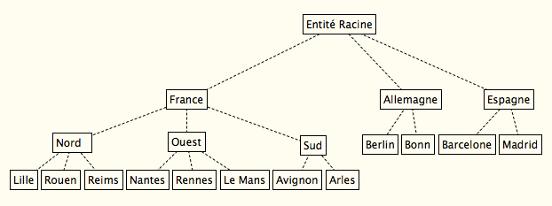

# Configuration générale

## Configuration basique
### Langue française

Modifier la langue de l'administrateur `glpi` pour utiliser la langue française.

### Langue par défaut

Menu `Configuration > Générale`

Langages par défaut : choisir les langues par défaut

Format des dates : choisir le format de date français.

### Sécurisation des comptes
Une bonne pratique lors de l'installation de GLPI est de sécuriser les comptes.

Menu `Administration > Utilisateurs`

Pour chaque utilisateur existant, changer le mot de passe

Ne pas oublier de **noter vos mots de passe en lieu sûr**.

## Découverte de GLPI

### Importation de la base de données de démonstration

La base de données se situe [ici](data/glpi-9.1.3-init-demo.sql.gz).

Importez cette base de données dans GLPI.

Pour cela:

1. placez ce fichier dans le répertoire `glpi/files/_dumps`
2. allez dans le menu GLPI `Administration > maintenance`
3. cliquez sur le bouton `Restaurer` placé en face du fichier correspondant

### Menus

Nous allons maintenant explorer les menus de niveau 1:
 - Parc
 - Assistance
 - Gestion
 - Outils
 - Administration
 - Configuration

 ### Identifier les usages

 Que doivent pouvoir faire les utilisateurs ?

 À partir de la [mise en situation](Mise-En-Situation.md), indiquez ce que doivent pouvoir faire les utilisateurs et les techniciens/administrateurs en charge du SI.

 Par exemple:

  - Utilisateurs:
   - Demander un changement de cartouche d'imprimante

  - Technicien:
   - Affecter un ordinateur à un utilisateur
   - Etablir un lien entre un ordinateur et un moniteur

 Essayez de déterminer dans quel menu peuvent se faire chacun de ces usages dans GLPI.

## Personnalisation de l'outil

### Organisation de l'entreprise par entités

#### Utilité des entités

Les entités permettent de découper l'entreprise en départements, services, directions, etc. "Entité" est donc un terme générique.

Dans GLPI, les entités servent à affecter un équipement à un département, service, direction, etc. Chaque utilisateur est également affecté à une entité. En fonction de son profil, il aura une visibilité et des droits différents sur les équipements.

Les droits de modification/utilisation d'un équipement (ouverture de ticket, réservation) se font donc en fonction de la combinaison de:

 - l'entité de l'équipement
 - l'entité de l'utilisateur


#### Exemple

L'entreprise dans laquelle est déployée GLPI possède l'organisation suivante:



L'organisation est saisie manuellement via le menu `Administration > Entités`


 - Entité racine

Dans l'exemple actuel de GLPI, elle est nommée `MaSociétéDémo`

Les entités de premier niveau représentent ici le pays

 - France

Commentaire: Société mère

 - Espagne

Commentaire: Filiale Espagnole du groupe

 - Allemagne

Commentaire: Filiale Allemande du groupe

## Prise en compte des entités

Une fois les entités créées **SE DECONNECTER** puis se reconnecter

## Ajout de sous-entités à l'entité Ouest

Menu `Administration > Entités`

Sélectionner l'entité Ouest

Cliquer sur le sous-menu `Entités`

Dans la section `Nouvel intitulé enfant`

Entrer un nom

Laval

Cliquer sur Ajouter

Cliquer sur l'entité Laval depuis Ouest + sous-entités

Ajout des adresses dans les Entités situées dans les villes

 - Rennes

   - 18 boulevard de la Tour d'Auvergne

 - Nantes

   - 44 avenue de la Duchesse Anne

 - Laval

    - 27 rue du Mont

 - Le Mans

    - 24 rue des Heures


## Profils

### Définition simpliste

#### un profil est une liste de droits, définissant pour chaque fonction de l’application l’autorisation d’utiliser ou non cette fonction.

### Les profils par défaut

#### Technicien

Ce profil correspond à la fonction de technicien de service informatique. Il permet d’accéder aux fonctions de gestion de parc en lecture et d’intervenir dans le traitement des tickets du helpdesk.

#### Supervisor

Ce profil possède des droits similaires à ceux du technicien et possède les droits pour gérer l’organisation d’une équipe (attribution des tickets).

#### Super-Admin

Ce profil possède tous les droits et donc celui de configurer et de paramétrer l’application. Le nombre d’utilisateurs ayant ce profil doit rester restreint.

Les comptes suivants sont les comptes par défaut ayant le profil Super-Admin:

 - glpi

 - tech

** Ne jamais associer l'interface simplifiée** à ce profil sinon la configuration de GLPI peut devenir impossible de manière définitive

#### Self-Service

Ce profil est dédié au dépôt de tickets d’assistance. Il est défini à l’installation de GLPI comme étant le profil par défaut. Ainsi, GLPI attribue ce profil à tout nouvel utilisateur qui se connecte. Vous découvrirez dans ce chapitre comment les droits peuvent être attribués à un utilisateur (application d’un profil sur une ou plusieurs entités).

#### Observateur

Ce profil n’accède qu’en lecture aux informations liées à l’inventaire et à sa gestion. S’agissant des tickets, ce profil peut les déclarer ou s’en voir attribuer mais il ne peut pas en attribuer.

#### Hotliner

Ce profil permet de faire la saisie des tickets et d’avoir accès à leur suivi. En revanche, ce profil ne permet pas de les prendre en charge.

#### Admin

Ce profil administre les droits sur l’intégralité du logiciel GLPI. Cependant, il n’a pas accès à toutes les fonctionnalités sur la configuration des règles, des entités et autres points sensibles pouvant dégrader les actions de GLPI.


## Les interfaces
### Interface simplifiée

Pour les demandeurs d'assistance

Connectez-vous avec `post-only` pour essayer

### Interface standard

Créez un utilisateur avec le profil `Hotliner` et vérifiez à quels menus il a accès.

## Exploration des profils par défaut

Explorer la section `Administration > Profils` permet de visualiser les affectations faites à chaque profil. Attention: gardez en mémoire que supprimer des droits au profil Super-Admin peut bloquer l'utilisation de GLPI.


## Création d'une sauvegarde de la BDD

Une fois la configuration générale effectuée, on va réaliser une sauvegarde

### En mode graphique

C'est la section `Administration > Maintenance` qui permet de réaliser une sauvegarde, mais aussi de la restaurer.

### En mode serveur


La ligne de commande Linux permet également de faire des sauvegardes

#### Création
```bash
mysqldump -u root -p glpi > backup-$(date +%Y%m%d%H%M%S).sql
```


#### Restauration
````bash
mysql -u root -p glpi < nomfichier.sql
```
